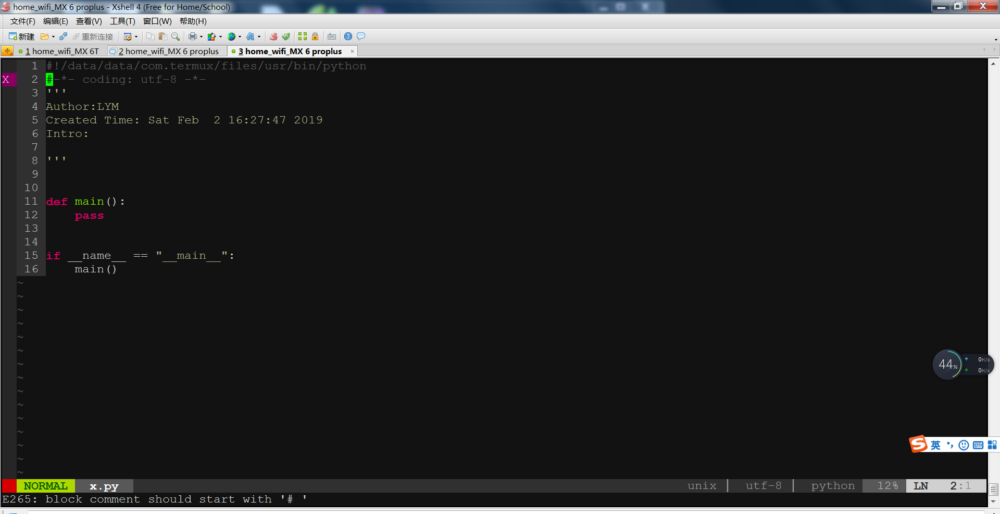

# 😎 打造超级 Vim

将 Vim 搭建为 python IDE.



## 🚀 立即为 `Vim` 换身衣服
 ```bash
git clone https://github.com/ChinaLym/autoSuperVim
cd autoSuperVim
sh auto_install.sh
```

## 为您安装的 vim 插件列表：

- 📦️ **插件管理器**: `gmarik/vundle`
- ▶️ **自动缩进**: `vim-scripts/indentpython.vim`
- 📏 **缩进指示器** `Yggdroot/indentLine`
- 📂 **代码折叠插件** `tmhedberg/SimpylFold`
- 🔠 **自动补全括号、引号** `jiangmiao/auto-pairs`
- 🔧 **python 代码格式化工具** `tell-k/vim-autopep8` (需要pip install autopep8)
- 🔍 **自动检查python语法**: `w0rp/ale`
- 🧩 **自动补全代码**: `davidhalter/jedi-vim`
- 🌟 **美化状态栏** `Lokaltog/vim-powerline`
- 🌈 **配色主题molokai** `https://github.com/tomasr/molokai`
- 🎄 **目录树**: `scrooloose/nerdtree`

# 其他

- 若缺少python组件会自动下载，输入 `y` 确认即可
- 安装中会自动打开一次`vim`进行自动检测，输入`:q`退出即可
- 背景：在安装手机中装了 `termux` 来学习 linux，起了兴趣直接使用手机编程，运行程序，避免频繁开关机，还能一直运行，为了在 linux 下编程舒服一点，汇总了好用的插件。
